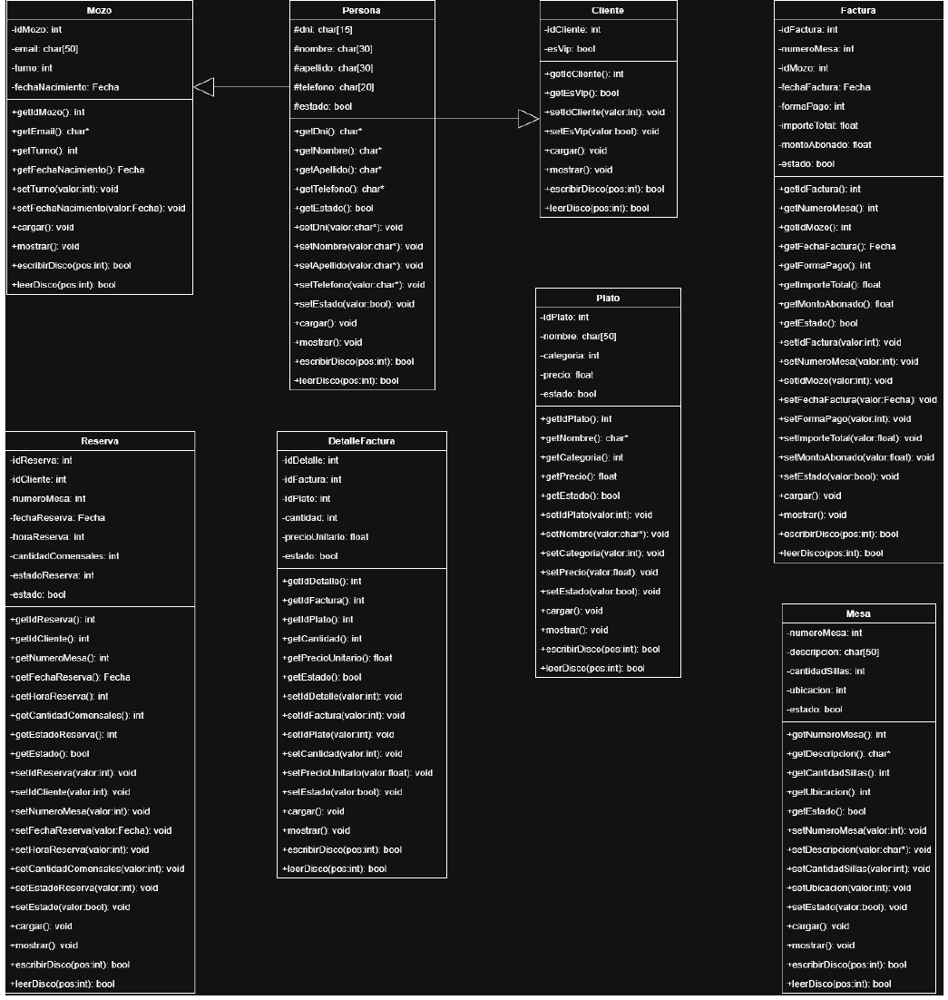

# Informe de Proyecto

## Sistema Integral de Gestión de Restaurante, Reservas y Facturación

**Alumnos:**

- Trunso, Daniel
- Fernández, Gustavo
- Lavini, Ignacio
- Pisano, Mateo

**Materia:** Programación 2

**Profesores:**

- Kloster, Daniel
- Simón, Angel
- Lara Campos, Brian

**Fecha:** 29 de Abril de 2026

## Indice

- [Introducción](#introducción)
- [Descripción detallada del sistema](#descripción-detallada-del-sistema)
- [Salidas del sistema](#salidas-del-sistema)
  - [Listados](#listados)
  - [Consultas](#consultas)
  - [Informes](#informes)
- [Anexo I: Diagrama de clases](#anexo-i-diagrama-de-clases)

## Introducción

Nuestro sistema permitirá gestionar las operaciones principales de un restaurante, incluyendo la administración de mesas, mozos, clientes, reservas y facturación. Contará con un conjunto de funcionalidades que facilitarán el registro, control y consulta de información.

## Descripción detallada del sistema

El objetivo principal del sistema es permitir la gestión integral de un restaurante, abarcando la administración de mesas, mozos, clientes, platos, reservas y facturación. La aplicación está orientada a facilitar el registro, control y consulta de la información, permitiendo optimizar las operaciones diarias del establecimiento.

El sistema gestiona los mozos que trabajan en el restaurante, registrando para cada uno un identificador único, su DNI, nombre, apellido, teléfono, email, fecha de nacimiento, turno de trabajo y estado. El turno indica el horario en el que el mozo desarrolla sus actividades, pudiendo ser mañana, tarde o noche.

Por otra parte, se administran las mesas del restaurante, las cuales se identifican mediante un número de mesa. De cada una se registra una descripción, la cantidad de sillas, su ubicación dentro del establecimiento (interior o terraza) y su estado, permitiendo determinar si se encuentra disponible o en uso.

El sistema también contempla la gestión de clientes, almacenando su identificador, documento o CUIT, nombre, apellido, teléfono, condición de cliente VIP y estado. Esto permite llevar un control de los clientes y mejorar la organización de reservas y servicios.

En cuanto a los productos ofrecidos, se administran los platos disponibles en el restaurante, registrando su identificador, nombre, categoría y precio. La categoría permite clasificar los platos en entradas, principales, postres o bebidas, facilitando su organización.

La gestión de reservas permite registrar la asignación de mesas a clientes en una fecha y horario determinados, indicando además la cantidad de comensales. Cada reserva cuenta con un estado que permite identificar si se encuentra pendiente, completada o cancelada, además de un estado general para su control dentro del sistema.

Las operaciones del restaurante se registran mediante facturas, en las cuales se almacena un identificador de factura, el número de mesa, el mozo que atendió, la fecha de la operación, la forma de pago, el importe total y el monto abonado por el cliente. Estas facturas permiten llevar un control de las ventas realizadas en el establecimiento.

Adicionalmente, el sistema cuenta con un archivo de detalle de facturas, el cual permite registrar los platos consumidos en cada operación. En este archivo se almacena el identificador del detalle, la factura asociada, el plato consumido, la cantidad y el precio unitario, permitiendo desglosar cada venta en sus respectivos ítems.

A través de estas funcionalidades, el sistema permite mantener un control organizado y estructurado de la información del restaurante, facilitando la gestión de los recursos, el seguimiento de las operaciones y la obtención de datos relevantes para la toma de decisiones.

## Salidas del sistema

El sistema generará tres tipos de salidas. Estas son Listados, Consultas e Informes.

### Listados

- Listado de Mozos
  - Listado ordenado por apellido.
  - Listado ordenado por turno.
- Listado de Mesas
  - Listado ordenado por número de mesa.
  - Listado ordenado por ubicación (Interior/Terraza).
- Listado de Clientes
  - Listado ordenado por apellido.
  - Listado filtrado por clientes VIP.
- Listado de Platos
  - Listado ordenado por nombre.
  - Listado ordenado por categoría.
  - Listado ordenado por precio.
- Listado de Reservas
  - Listado ordenado por fecha.
  - Listado ordenado por estado (Pendiente/Completada/Cancelada).
- Listado de Facturas
  - Listado ordenado por fecha.
  - Listado ordenado por número de mesa.

### Consultas

- Consulta de Mozos
  - Consulta por DNI.
  - Consulta por Turno.
- Consulta de Mesas
  - Consulta por número de mesa.
  - Consulta por ubicación.
- Consulta de Clientes
  - Consulta por DNI.
  - Consulta por condición VIP.
- Consulta de Platos
  - Consulta por categoría.
  - Consulta por rango de precios.
- Consulta de Reservas
  - Consulta por fecha.
  - Consulta por cliente.
  - Consulta por estado de reserva.
- Consulta de Facturas
  - Consulta por rango de fechas.
  - Consulta por número de mesa.
  - Consulta por mozo.

### Informes

A continuación se muestran los informes que el sistema generará:

- Recaudación por día.
- Recaudación por periodo.
- Platos más vendidos.
- Plato menos vendido.
- Cantidad de mesas que atendió el mozo.

#### Recaudación por día

Permite visualizar el total facturado en una fecha determinada.

#### Recaudación por periodo

Muestra el total facturado entre dos fechas ingresadas por el usuario.

#### Platos más vendidos

Permite identificar los platos con mayor cantidad de ventas.

#### Plato menos vendido

Permite identificar el plato con menor cantidad de ventas.

#### Cantidad de mesas que atendió el mozo

Muestra la cantidad de mesas atendidas por un mozo.

## Anexo I: Diagrama de clases

